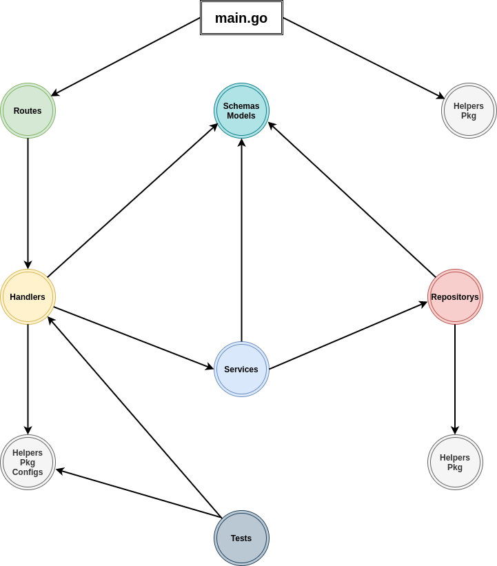

# Golang Clean Architecture (Maintenance)

The following is a folder structure pattern that I usually use, although I don't use all of them because of the project I'm working on only small projects that are not too big, so if you are interested in the pattern I made, you can use it if you think it's good.

## What are the benefits ?

- [x] Easy to maintance 
- [x] Easy to scalable you project
- [x] Readable code
- [x] Suitable for large projects or small projects
- [x] Easy to understand for junior or senior
- [x] And more

## Flow Diagram



## Folder Structure Pattern

```
├── tests
│   └── test.auth_test.go
│   └── test.student_test.go
└── docker
│   └── swagger
│   │     └── Dockerfile
│   │     └── openapi.yml
│   └── mysql
│   │     └── Dockerfile
│   │     └── mysql.cnf
│   └── golang
│   │     └── Dockerfile
├── handlers
│   └── auth
│   │     └── handler.login.go
│   │     └── handler.register.go
│   └── student
│   │     └── handler.create.go
│   │     └── handler.create.go
└── repositorys
│   └── auth
│   │     └── repository.login.go
│   │     └── repository.register.go
│   └── student
│   │     └── repository.create.go
│   │     └── repository.create.go
└── services
│   └── auth
│   │     └── services.login.go
│   │     └── services.register.go
│   └── student
│   │     └── services.create.go
│   │     └── services.create.go
└── helpers
│   └── helpers.apiResponse.go
│   └── helpers.randomString.go.go
└── middlewares
│   └── middleware.auth.go
│   └── middleware.role.go.go
└── models
│   └── model.auth.go
│   └── model.student.go.go
└── routes
│   └── route.auth.go
│   └── route.student.go
└── schemas
│   └── schema.auth.go
│   └── schema.student.go.go
└── templates
│   └── template.register.html
│   └── template.activation.html
└── pkg
│   └── pkg.jwt.go
│   └── pkg.bcrypt.go
│   └── pkg.cron.go
└── scripts
│   └── gcpRunner.sh
│   └── awsRunner.sh
└── configs
│   └── openapi.yml
│   └── serverless.yml
└── cmd
│   └── cmd.pgMigration.go
│   └── cmd.pgSeeds.go
└── crons
│   └── cron.autoDeleteLogs.go
│   └── cron.emailBlast.go
└── databases
│   └── migrations
│   │     └── migration.auth.go
│   │     └── migration.student.go
│   └── seeds
│   │     └── seed.auth.go
│   │     └── seed.student.go
│   └── sql
│   │     └── sql.auth.sql
│   │     └── sql.student.sql
```

## Folder Status And Description

- #### Tests
| **Folder Name** | **Folder Status** | **Description**                                                                                                                                                                                         |
| --------------- | ----------------- | ------------------------------------------------------------------------------------------------------------------------------------------------------------------------------------------------------- |
| *Tests*         | *Optional*        | *A collection of functions used to create a series of tests or run a test, be it unit testing or integration testing, which will later be used for the application itself.* | 

- #### Docker   
| **Folder Name** | **Folder Status** | **Description**                                                                                                                                                   |
| --------------- | ----------------- | ----------------------------------------------------------------------------------------------------------------------------------------------------------------- |
| *Docker*        | *Optional*        | *A collection of functions that are used to create a container for the application that has been created, which will later be used for the application itself.* | 

- #### Handlers
| **Folder Name** | **Folder Status** | **Description**                                                                                                                                                                                                                                                                   |
| --------------- | ----------------- | --------------------------------------------------------------------------------------------------------------------------------------------------------------------------------------------------------------------------------------------------------------------------------- |
| *Hanlders*      | *Optional*        | *A collection of functions used to handle all requests passed down from the client via routing, where later those requests will be forwarded to services and repositories for further processing, which will later be used for the application itself.* | 

- #### Repositorys  
| **Folder Name** | **Folder Status** | **Description**                                                                                                                                                                                                                                         |
| --------------- | ----------------- | ------------------------------------------------------------------------------------------------------------------------------------------------------------------------------------------------------------------------------------------------------- |
| *Repositorys*   | *Required*        | *A collection of functions used to handle all requests given from handlers and services, which then those requests will be used to communicate with the database, which will later be used for the application itself.* | 

- #### Services
| **Folder Name** | **Folder Status** | **Description**                                                                                                                                                  |
| --------------- | ----------------- | ---------------------------------------------------------------------------------------------------------------------------------------------------------------- |
| *Services*      | *Required*        | *A collection of functions that are used to forward requests given by handlers to repositories, which will later be used for the application itself.* | 

- #### Helpers
| **Folder Name** | **Folder Status** | **Description**                                                                                                                                                            |
| --------------- | ----------------- | -------------------------------------------------------------------------------------------------------------------------------------------------------------------------- |
| *Helpers*       | *Optional*        | *A collection of functions used to create utilities for application purposes, such as customError or customResponse, which will later be used for the application itself.* | 

- #### Middlewares
| **Folder Name** | **Folder Status** | **Description**                                                                                                                                                                                                                                                                 |
| --------------- | ----------------- | ------------------------------------------------------------------------------------------------------------------------------------------------------------------------------------------------------------------------------------------------------------------------------- |
| *Middlewares*   | *Optional*        | *A collection of functions that are used as a service for HTTP Requests such as authJWt, authRole, customLogger whether used per-route or used globally without the need to use them in each route, which will later be used for the application itself.* | 

- #### Models 
| **Folder Name** | **Folder Status** | **Description**                                                                                                                                           |
| --------------- | ----------------- | --------------------------------------------------------------------------------------------------------------------------------------------------------- |
| *Models*        | *Required*        | *A collection of functions used to represent the table structure in a database, which will later be used for the application itself.* | 

- #### Routes
| **Folder Name** | **Folder Status** | **Description**                                                                                                                                                                    |
| --------------- | ----------------- | ---------------------------------------------------------------------------------------------------------------------------------------------------------------------------------- |
| *Routes*        | *Required*        | *A collection of endpoints or addresses from the server itself, which is used for communication lines between the client and the server, which will later be used for the application itself.* | 

- #### Schemas
| **Folder Name** | **Folder Status** | **Description**                                                                                                                                                                                              |
| --------------- | ----------------- | ------------------------------------------------------------------------------------------------------------------------------------------------------------------------------------------------------------ |
| *Schemas*       | *Required*        | *A collection of functions that are used to represent the desired request structure, according to the requests required by the database, which will later be used for the application itself.* | 

- #### Templates
| **Folder Name** | **Folder Status** | **Description**                                                                                                                                                                                                                             |
| --------------- | ----------------- | ------------------------------------------------------------------------------------------------------------------------------------------------------------------------------------------------------------------------------------------- |
| *Templates*     | *Optional*        | *A collection of functions that are used to output HTML code into emails to be used as templates, which will later be used for purposes such as activationCode or resetPassword, which will later be used for the application itself.* | 

- #### Pkg
| **Folder Name** | **Folder Status** | **Description**                                                                                                                                                                 |
| --------------- | ----------------- | ------------------------------------------------------------------------------------------------------------------------------------------------------------------------------- |
| *Pkg*           | *Optional*        | *A collection of functions that are used for the purpose of customizing a library into a separate function, which will later be used for the application itself.* |

- #### Scripts
| **Folder Name** | **Folder Status** | **Description**                                                                                                                                                                                                                   |
| --------------- | ----------------- | --------------------------------------------------------------------------------------------------------------------------------------------------------------------------------------------------------------------------------- |
| *Scripts*       | *Optional*        | *A collection of functions that are used to trigger a function from another function, such as importing a database from a .sql file into a container using docker, which will later be used for the application itself.* | 

- #### Configs
| **Folder Name** | **Folder Status** | **Description**                                                                                                                                                            |
| --------------- | ----------------- | -------------------------------------------------------------------------------------------------------------------------------------------------------------------------- |
| *Configs*       | *Optional*        | *A collection of functions that contains all the configurations related to the application needs, such as .env or serverless.yml, which will later be used for the application itself.* | 

- #### Cmd
| **Folder Name** | **Folder Status** | **Description**                                                                                                                                                                                                                       |
| --------------- | ----------------- | ------------------------------------------------------------------------------------------------------------------------------------------------------------------------------------------------------------------------------------- |
| *Cmd*           | *Optional*        | *A collection of functions that are used to interact directly with the terminal, usually used for purposes such as running database migrations or seeds, which will later be used for the application itself.* | 

- #### Crons
| **Folder Name** | **Folder Status** | **Description**                                                                                                                                                                                         |
| --------------- | ----------------- | ------------------------------------------------------------------------------------------------------------------------------------------------------------------------------------------------------- |
| *Crons*         | *Optional*        | *A collection of functions that are used to trigger a desired function, according to the time specified by the user, which will later be used for the application itself.* | 

- #### Databases
| **Folder Name** | **Folder Status** | **Description**                                                                                                                                       |
| --------------- | ----------------- | ----------------------------------------------------------------------------------------------------------------------------------------------------- |
| *Databases*     | *Optional*        | *A collection of functions used to create migrations or seeds for the database, which will later be used for the application itself.* | 


## Command

- ### Application Lifecycle

  - Install node modules

  ```sh
  $ go get . || go mod || make goinstall
  ```

  - Build application

  ```sh
  $ go build -o main || make goprod
  ```

  - Start application in development

  ```sh
  $ go run main.go | make godev
  ```

  - Test application

  ```sh
  $ go test main.go main_test.go || make gotest
  ```

* ### Docker Lifecycle

  - Build container

  ```sh
  $ docker-compose build | make dcb
  ```

  - Run container with flags

  ```sh
  $ docker-compose up -d --<flags name> | make dcu f=<flags name>
  ```

  - Run container build with flags

  ```sh
  $ docker-compose up -d --build --<flags name> | make dcubf f=<flags name>
  ```

  - Run container

  ```sh
  $ docker-compose up -d --build | make dcu
  ```

  - Stop container

  ```sh
  $ docker-compose down | make dcd
  ```
