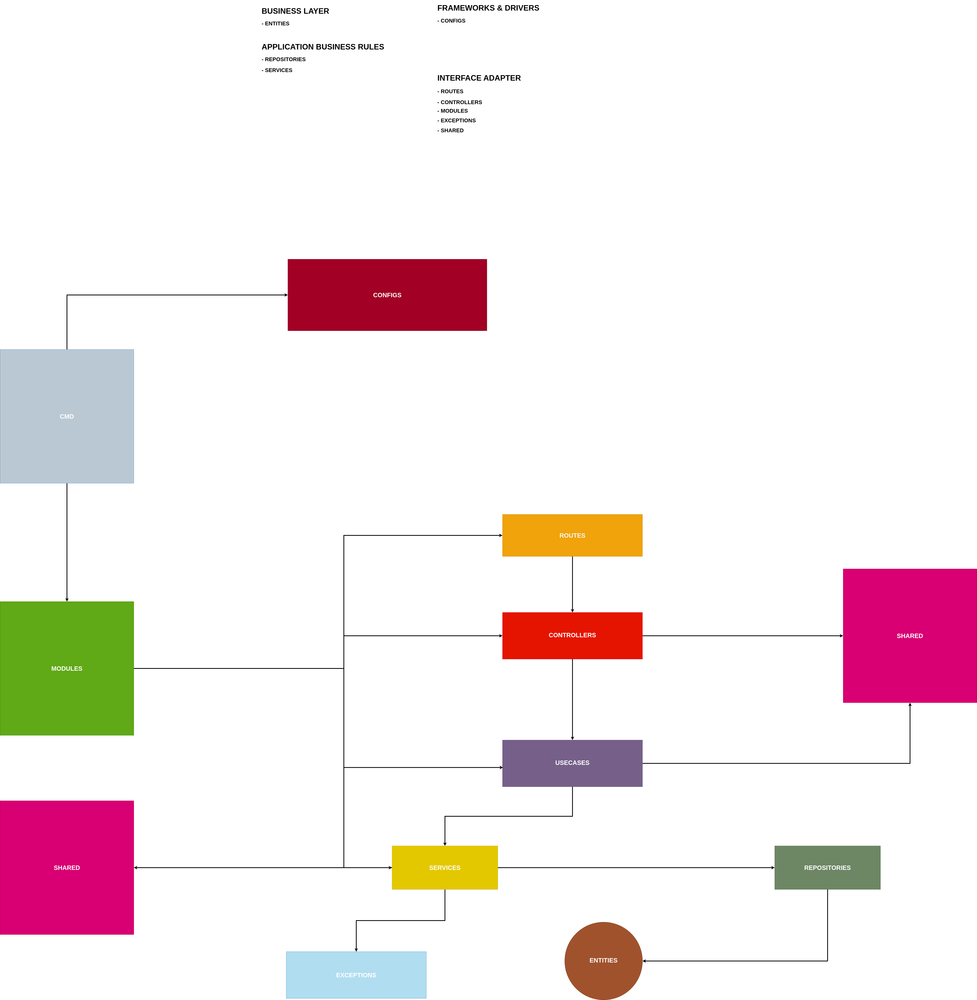

# Golang Clean Architecture (Maintenance)

The following is a folder structure pattern that I usually use, although I don't use all of them because of the project I'm working on only small projects that are not too big, so if you are interested in the pattern I made, you can use it if you think it's good.

## What are the benefits ?

[x] Easy to maintance 
[x] Easy to scalable you project
[x] Readable code
[x] Suitable for large projects or small projects
[x] Easy to understand for junior or senior
[x] Familiar structure folder for any developer 
[x] And more

## Flow Diagram



## Folder Structure Pattern

```
├── tests
│   └── test.auth_test.go
│   └── test.student_test.go
└── docker
│   └── swagger
│   │     └── Dockerfile
│   │     └── openapi.yml
│   └── mysql
│   │     └── Dockerfile
│   │     └── mysql.cnf
│   └── golang
│   │     └── Dockerfile
├── handlers
│   └── auth
│   │     └── handler.login.go
│   │     └── handler.register.go
│   └── student
│   │     └── handler.create.go
│   │     └── handler.create.go
└── repositorys
│   └── auth
│   │     └── repository.login.go
│   │     └── repository.register.go
│   └── student
│   │     └── repository.create.go
│   │     └── repository.create.go
└── services
│   └── auth
│   │     └── services.login.go
│   │     └── services.register.go
│   └── student
│   │     └── services.create.go
│   │     └── services.create.go
└── helpers
│   └── helpers.apiResponse.go
│   └── helpers.randomString.go.go
└── middlewares
│   └── middleware.auth.go
│   └── middleware.role.go.go
└── models
│   └── model.auth.go
│   └── model.student.go.go
└── routes
│   └── route.auth.go
│   └── route.student.go
└── schemas
│   └── schema.auth.go
│   └── schema.student.go.go
└── templates
│   └── template.register.html
│   └── template.activation.html
└── pkg
│   └── pkg.jwt.go
│   └── pkg.bcrypt.go
│   └── pkg.cron.go
└── scripts
│   └── gcpRunner.sh
│   └── awsRunner.sh
└── configs
│   └── openapi.yml
│   └── serverless.yml
└── cmd
│   └── cmd.pgMigration.go
│   └── cmd.pgSeeds.go
└── crons
│   └── cron.autoDeleteLogs.go
│   └── cron.emailBlast.go
└── databases
│   └── migrations
│   │     └── migration.auth.go
│   │     └── migration.student.go
│   └── seeds
│   │     └── seed.auth.go
│   │     └── seed.student.go
│   └── sql
│   │     └── sql.auth.sql
│   │     └── sql.student.sql
```

## Folder Status And Description

- #### Tests
| **Folder Name** | **Folder Status** | **Description**                                                                                                                                                                                         |
| --------------- | ----------------- | ------------------------------------------------------------------------------------------------------------------------------------------------------------------------------------------------------- |
| *Tests*         | *Optional*        | *Kumpulan fungsi yang digunakan untuk membuat serangkaian test atau menjalankan sebuah test, baik itu unit testing atau integration testing, yang nanti nya akan digunakan untuk aplikasi itu sendiri.* | 

- #### Docker   
| **Folder Name** | **Folder Status** | **Description**                                                                                                                                                   |
| --------------- | ----------------- | ----------------------------------------------------------------------------------------------------------------------------------------------------------------- |
| *Docker*        | *Optional*        | *Kumpulan fungsi yang digunakan untuk membuat sebuah wadah container untuk aplikasi yang telah dibuat, yang nanti nya akan digunakan untuk aplikasi itu sendiri.* | 

- #### Handlers
| **Folder Name** | **Folder Status** | **Description**                                                                                                                                                                                                                                                                   |
| --------------- | ----------------- | --------------------------------------------------------------------------------------------------------------------------------------------------------------------------------------------------------------------------------------------------------------------------------- |
| *Hanlders*      | *Optional*        | *Kumpulan fungsi yang digunakan untuk menghandle semua request yang di kirimkan dari client melalui routing, dimana nanti requestnya tersebut akan di teruskan ke service dan repository untuk di proses lebih lanjut, yang nanti nya akan digunakan untuk aplikasi itu sendiri.* | 

- #### Repositorys  
| **Folder Name** | **Folder Status** | **Description**                                                                                                                                                                                                                                         |
| --------------- | ----------------- | ------------------------------------------------------------------------------------------------------------------------------------------------------------------------------------------------------------------------------------------------------- |
| *Repositorys*   | *Required*        | *Kumpulan fungsi yang digunakan untuk menghandle semua request yang diberikan dari handlers dan services, yang kemudian request tersebut akan digunakan untuk berkomunikasi dengan database, yang nanti nya akan digunakan untuk aplikasi itu sendiri.* | 

- #### Services
| **Folder Name** | **Folder Status** | **Description**                                                                                                                                                  |
| --------------- | ----------------- | ---------------------------------------------------------------------------------------------------------------------------------------------------------------- |
| *Services*      | *Required*        | *Kumpulan fungsi yang digunakan untuk meneruskan request yang diberikan oleh handlers ke repositorys, yang nanti nya akan digunakan untuk aplikasi itu sendiri.* | 

- #### Helpers
| **Folder Name** | **Folder Status** | **Description**                                                                                                                                                            |
| --------------- | ----------------- | -------------------------------------------------------------------------------------------------------------------------------------------------------------------------- |
| *Helpers*       | *Optional*        | *Kumpulan fungsi yang digunakan untuk membuat utilitas untuk keperluan aplikasi seperti customError atau customResponse, yang nanti nya akan digunakan untuk aplikasi itu sendiri.* | 

- #### Middlewares
| **Folder Name** | **Folder Status** | **Description**                                                                                                                                                                                                                                                                 |
| --------------- | ----------------- | ------------------------------------------------------------------------------------------------------------------------------------------------------------------------------------------------------------------------------------------------------------------------------- |
| *Middlewares*   | *Optional*        | *Kumpulan fungsi yang digunakan sebagai layanan keperluan Http Request seperti authJWt, authRole, customLogger baik itu digunakan per-route atau digunakan secara global tanpa perlu menggunakannya di setiap route, yang nanti nya akan digunakan untuk aplikasi itu sendiri.* | 

- #### Models 
| **Folder Name** | **Folder Status** | **Description**                                                                                                                                           |
| --------------- | ----------------- | --------------------------------------------------------------------------------------------------------------------------------------------------------- |
| *Models*        | *Required*        | *Kumpulan fungsi yang digunakan untuk merepresentasikan structure table dalam sebuah database, yang nanti nya akan digunakan untuk aplikasi itu sendiri.* | 

- #### Routes
| **Folder Name** | **Folder Status** | **Description**                                                                                                                                                                    |
| --------------- | ----------------- | ---------------------------------------------------------------------------------------------------------------------------------------------------------------------------------- |
| *Routes*        | *Required*        | *Kumpulan endpoint atau alamat dari server itu sendiri, yang digunakan untuk jalur komunikasi antara client dan server, yang nanti nya akan digunakan untuk aplikasi itu sendiri.* | 

- #### Schemas
| **Folder Name** | **Folder Status** | **Description**                                                                                                                                                                                              |
| --------------- | ----------------- | ------------------------------------------------------------------------------------------------------------------------------------------------------------------------------------------------------------ |
| *Schemas*       | *Required*        | *Kumpulan fungsi yang digunakan untuk merepresentasikan structure request yang di inginkan, sesuai dengan request yang di perlukan oleh database, yang nanti nya akan digunakan untuk aplikasi itu sendiri.* | 

- #### Templates
| **Folder Name** | **Folder Status** | **Description**                                                                                                                                                                                                                             |
| --------------- | ----------------- | ------------------------------------------------------------------------------------------------------------------------------------------------------------------------------------------------------------------------------------------- |
| *Templates*     | *Optional*        | *Kumpulan fungsi yang digunakan untuk menampilkan sebuah code html kedalam sebuah email untuk dijadikan sebagai template, yang nantinya akan digunakan untuk keperluan seperti activationCode atau resetPassword, yang nanti nya akan digunakan untuk aplikasi itu sendiri.* | 

- #### Pkg
| **Folder Name** | **Folder Status** | **Description**                                                                                                                                                                 |
| --------------- | ----------------- | ------------------------------------------------------------------------------------------------------------------------------------------------------------------------------- |
| *Pkg*           | *Optional*        | *Kumpulan fungsi yang digunakan untuk keperluan customisasi sebuah library menjadi sebuah fungsi - fungsi tersendiri, yang nantinya akan digunakan untuk aplikasi itu sendiri.* | 

- #### Scripts
| **Folder Name** | **Folder Status** | **Description**                                                                                                                                                                                                                   |
| --------------- | ----------------- | --------------------------------------------------------------------------------------------------------------------------------------------------------------------------------------------------------------------------------- |
| *Scripts*       | *Optional*        | *Kumpulan fungsi yang digunakan untuk mentriger sebuah fungsi dari fungsi lain, seperti importing database dari file .sql kedalam sebuah wadah container menggunakan docker, yang nanti nya akan digunakan untuk aplikasi itu sendiri.* | 

- #### Configs
| **Folder Name** | **Folder Status** | **Description**                                                                                                                                                            |
| --------------- | ----------------- | -------------------------------------------------------------------------------------------------------------------------------------------------------------------------- |
| *Configs*       | *Optional*        | *Kumpulan fungsi yang berisikan semua konfigurasi terkait keperluan aplikasi, seperti .env atau serverless.yml, yang nanti nya akan digunakan untuk aplikasi itu sendiri.* | 

- #### Cmd
| **Folder Name** | **Folder Status** | **Description**                                                                                                                                                                                                                       |
| --------------- | ----------------- | ------------------------------------------------------------------------------------------------------------------------------------------------------------------------------------------------------------------------------------- |
| *Cmd*           | *Optional*        | *Kumpulan fungsi yang digunakan untuk berinteraksi secara langsung dengan terminal, biasa nya digunakan untuk keperluan seperti menjalankan migration database atau seeds, yang nanti nya akan digunakan untuk aplikasi itu sendiri.* | 

- #### Crons
| **Folder Name** | **Folder Status** | **Description**                                                                                                                                                                                         |
| --------------- | ----------------- | ------------------------------------------------------------------------------------------------------------------------------------------------------------------------------------------------------- |
| *Crons*         | *Optional*        | *Kumpulan fungsi yang digunakan untuk mentriger sebuah fungsi yang di inginkan, sesuai dengan waktu yang telah di tentukan oleh si pengguna, yang nanti nya akan digunakan untuk aplikasi itu sendiri.* | 

- #### Databases
| **Folder Name** | **Folder Status** | **Description**                                                                                                                                       |
| --------------- | ----------------- | ----------------------------------------------------------------------------------------------------------------------------------------------------- |
| *Databases*     | *Optional*        | *Kumpulan fungsi yang digunakan untuk membuat sebuah migrations atau seeds untuk database, yang nanti nya akan digunakan untuk aplikasi itu sendiri.* | 


## Command

- ### Application Lifecycle

  - Install node modules

  ```sh
  $ go get . || go mod || make goinstall
  ```

  - Build application

  ```sh
  $ go build -o main || make goprod
  ```

  - Start application in development

  ```sh
  $ go run main.go | make godev
  ```

  - Test application

  ```sh
  $ go test main.go main_test.go || make gotest
  ```

* ### Docker Lifecycle

  - Build container

  ```sh
  $ docker-compose build | make dcb
  ```

  - Run container with flags

  ```sh
  $ docker-compose up -d --<flags name> | make dcu f=<flags name>
  ```

  - Run container build with flags

  ```sh
  $ docker-compose up -d --build --<flags name> | make dcubf f=<flags name>
  ```

  - Run container

  ```sh
  $ docker-compose up -d --build | make dcu
  ```

  - Stop container

  ```sh
  $ docker-compose down | make dcd
  ```
